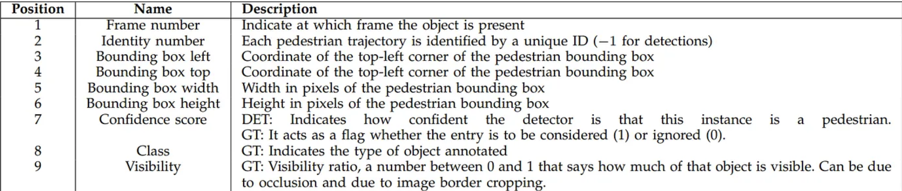

# football-object-detection

## Setup

1. Install the required packages:
```bash
pip install -r requirements.txt
``` 
2. Copy the dataset
```bash
cp -r /path/to/your/dataset ./data
```
3. Format the dataset
```bash
python format_dataset.py
```

